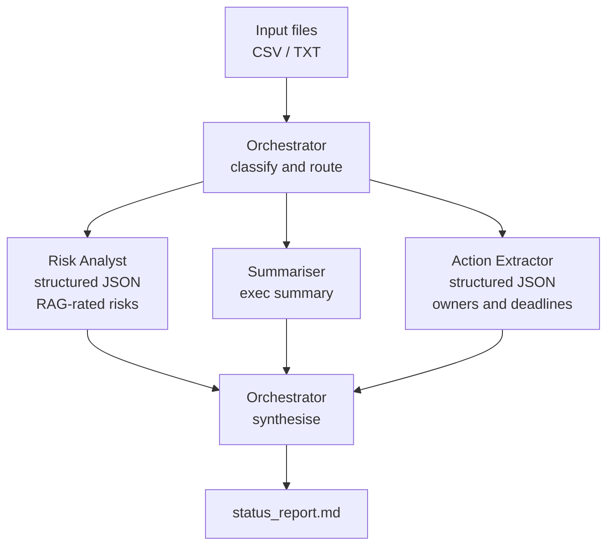

# Delivery Copilot

An agentic CLI that turns messy project artefacts (RAID logs, meeting notes, task lists) into an executive-ready status report, built on the Anthropic API using an orchestrator-worker pattern.

Built by a Senior Delivery Manager with 5+ years leading digital transformation programmes for UK Central Government, as a practical demonstration of multi-agent architecture using the API primitives directly (no frameworks).

## Why this exists

Delivery managers spend hours each week consolidating RAID logs, meeting notes and trackers into status reports. This tool automates that workflow with a small team of specialist AI agents, each with a narrow job, coordinated by an orchestrator. The interesting part is not the report. It is the architecture.

## Architecture



**Pattern: orchestrator-worker.** The orchestrator makes a cheap classification call to decide which specialists each input needs, fans work out to them, then makes a final synthesis call combining their outputs into one report.

## Design decisions

| Decision | Rationale | Trade-off |
|---|---|---|
| Raw Anthropic SDK, no framework | Demonstrates understanding of the primitives: system prompts, stop sequences, structured outputs | More boilerplate than LangChain, but full visibility and control |
| Orchestrator-worker over single prompt | Narrow prompts per agent give more reliable structured output; agents are independently testable and swappable | More API calls, higher latency and cost than one big prompt |
| Assistant prefilling for JSON (initial design) | Prefilling the response with `{` plus defensive fence-stripping gave reliable machine-readable output without a heavier tool-use schema | Removed in Claude 4.6, which no longer accepts an assistant turn as a prefill; replaced with prompt-based JSON instruction and the same defensive fence-stripping on the response |
| Prompt-based JSON output after prefill deprecation | Instructing the model to return raw JSON only within the system prompt produces equivalent behaviour to prefilling and is forward-compatible | Slightly less deterministic than a hard prefill start; tool use would be stricter but adds schema overhead |
| In-prompt deduplication for risks and actions | The same risk or action often appears across multiple source files; the synthesiser prompt instructs the model to merge near-duplicates before rendering the tables, reducing noise in the output | Merging is done by the LLM and can miss cases where wording differs significantly; a post-processing step would be more reliable but adds complexity |
| Sonnet for workers, Opus for synthesis | Cost-aware model routing: cheap fast models for narrow extraction, stronger model where judgement matters | Could run everything on one model; this mirrors production cost patterns |
| Prompts as files, not strings | Prompt changes do not require code changes; visible in version control | Slightly more setup |

## Limitations and known issues

The generated report should be reviewed carefully before sharing. Known failure modes:

- **Duplicate entries.** The same risk or action extracted from multiple source files may appear more than once in the tables even after deduplication, particularly when the wording differs enough to fool the merge step. Scan the Risk Register and Actions table for near-duplicates before submitting.
- **Inconsistent counts.** The executive summary is written before the tables are finalised. Stated counts (e.g. "three Red risks") can diverge from the actual table rows if deduplication reduces the total. Always verify that numbers in the summary match the table.
- **Conflicting narratives.** When input files contradict each other (e.g. a task marked Complete in one file and In Progress in another), the synthesiser picks one version without flagging the conflict. Check the source files if any status looks unexpected.
- **Invented detail.** On rare occasions the model may embellish a risk mitigation or action description beyond what the source text supports. Treat all free-text fields as drafts and verify against the originals.
- **RAG rating drift.** Ratings are assigned by the Risk Analyst agent from unstructured text. Subjective or ambiguous language can lead to over- or under-stated severity. Apply your own judgement before circulating.

These are inherent limitations of LLM-based extraction from unstructured input, not bugs. The tool is designed to accelerate a first draft, not to replace human review.

## What I would add next

- Evals: a small golden dataset of inputs and expected risk extractions, scored on each change
- Parallel agent execution with asyncio to cut latency
- Token and cost logging per run
- A confidence field in agent outputs so the orchestrator can flag low-confidence sections for human review

## Quick start

```bash
git clone https://github.com/YOUR_USERNAME/delivery-copilot
cd delivery-copilot
pip install -r requirements.txt
set ANTHROPIC_API_KEY=your-key-here   # Windows
python main.py samples/raid_log.csv samples/meeting_notes.txt --output output/report.md
```

## Sample output

The following is a trimmed excerpt from a report generated against the sample inputs.

---

### Executive Summary

Project Helios is rated Amber following Sprint 4, with 34 of 42 story points delivered. Progress was made across the auth flow, order history API, frontend component library, and performance benchmarking. However, the project carries three active Red risks that require immediate executive attention: AWS security sign-off remains outstanding and threatens a two-week schedule slip; automated database backups have been down since 31 May, creating a live data loss exposure; and the UAT environment has been delayed twice and is not expected until 16 June, compressing the available test window. The payment provider has also not confirmed v3 API compatibility after three weeks, with a feature flag being developed as a contingency. Two decisions are required urgently: steering group approval for the database migration maintenance window by 9 June, and CTO escalation on AWS sign-off by 10 June. The 18 July go-live remains at risk if these items are not resolved this week.

### Risk Register (excerpt)

| Risk | Category | RAG | Mitigation |
|---|---|---|---|
| AWS security approval has been pending since 1 June with no decision, blocking cloud infrastructure readiness and threatening a two-week schedule slip if unresolved by end of this week. | Dependency | Red | Sarah to escalate immediately to CTO with a hard deadline of 10 June; document the schedule impact formally to create urgency at executive level. |
| Payment provider has not confirmed v3 API compatibility after three weeks of no response, leaving the integration approach uncertain and risking payment integration failure at go-live. | Dependency / External | Red | Sarah to escalate to a senior account manager or commercial relationship owner by 12 June; James to implement a feature flag by 20 June to allow switching between API versions without redeployment. |
| Automated database backups have been down since 31 May (P1 incident I002 / OPS-2241), creating a critical data loss exposure; remediation task is currently blocked. | Technical | Red | Assign a named owner immediately; Ops to perform a manual backup and restore OPS-2241 monitoring as emergency priority today. Sarah to receive daily status updates until resolved. |
| UAT environment has been delayed twice by the infrastructure team and is now not expected until 16 June, blocking regression, smoke testing, and UAT execution. | Schedule | Red | James to escalate infrastructure delays to delivery manager and steering group; obtain a firm committed date with no further slippage tolerance. Lena to prepare the full UAT pack in advance so testing begins immediately on environment availability. |

---

## Built with

Python, Anthropic API, and Claude Code as the pair programmer. The commit history shows the incremental, agent-assisted build process.
