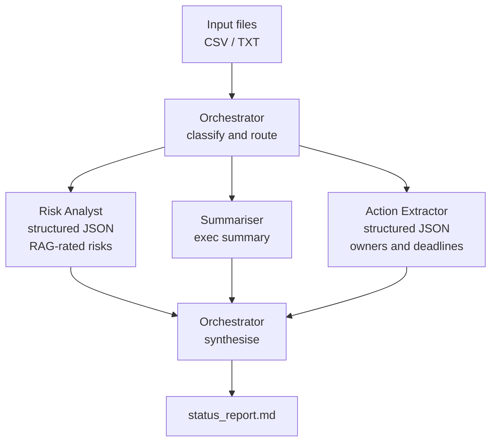

# Delivery Copilot

An agentic CLI that turns messy project artefacts (RAID logs, meeting notes, task lists) into an executive-ready status report, built on the Anthropic API using an orchestrator-worker pattern.

Built by a Senior Delivery Manager with 5+ years leading digital transformation programmes for UK Central Government, as a practical demonstration of multi-agent architecture using the API primitives directly (no frameworks).

## Why this exists

Delivery managers spend hours each week consolidating RAID logs, meeting notes and trackers into status reports. This tool automates that workflow with a small team of specialist AI agents, each with a narrow job, coordinated by an orchestrator. The interesting part is not the report. It is the architecture.

## Architecture



**Pattern: orchestrator-worker.** The orchestrator makes a cheap classification call to decide which specialists each input needs, fans work out to them, then makes a final synthesis call combining their outputs into one report.

## Design decisions

| Decision | Rationale | Trade-off |
|---|---|---|
| Raw Anthropic SDK, no framework | Demonstrates understanding of the primitives: system prompts, prefilling, stop sequences, structured outputs | More boilerplate than LangChain, but full visibility and control |
| Orchestrator-worker over single prompt | Narrow prompts per agent give more reliable structured output; agents are independently testable and swappable | More API calls, higher latency and cost than one big prompt |
| Assistant prefilling for JSON | Prefilling the response with `{` plus defensive fence-stripping gives reliable machine-readable output without a heavier tool-use schema | Tool use would be stricter; prefilling is simpler and sufficient here |
| Sonnet for workers, Opus for synthesis | Cost-aware model routing: cheap fast models for narrow extraction, stronger model where judgement matters | Could run everything on one model; this mirrors production cost patterns |
| Prompts as files, not strings | Prompt changes do not require code changes; visible in version control | Slightly more setup |

## Limitations and known issues

The generated report should be reviewed carefully before sharing. Known failure modes:

- **Duplicate entries.** The same risk or action extracted from multiple source files may appear more than once in the tables even after deduplication, particularly when the wording differs enough to fool the merge step. Scan the Risk Register and Actions table for near-duplicates before submitting.
- **Inconsistent counts.** The executive summary is written before the tables are finalised. Stated counts (e.g. "three Red risks") can diverge from the actual table rows if deduplication reduces the total. Always verify that numbers in the summary match the table.
- **Conflicting narratives.** When input files contradict each other (e.g. a task marked Complete in one file and In Progress in another), the synthesiser picks one version without flagging the conflict. Check the source files if any status looks unexpected.
- **Invented detail.** On rare occasions the model may embellish a risk mitigation or action description beyond what the source text supports. Treat all free-text fields as drafts and verify against the originals.
- **RAG rating drift.** Ratings are assigned by the Risk Analyst agent from unstructured text. Subjective or ambiguous language can lead to over- or under-stated severity. Apply your own judgement before circulating.

These are inherent limitations of LLM-based extraction from unstructured input, not bugs. The tool is designed to accelerate a first draft, not to replace human review.

## What I would add next

- Evals: a small golden dataset of inputs and expected risk extractions, scored on each change
- Parallel agent execution with asyncio to cut latency
- Token and cost logging per run
- A confidence field in agent outputs so the orchestrator can flag low-confidence sections for human review

## Quick start

```bash
git clone https://github.com/YOUR_USERNAME/delivery-copilot
cd delivery-copilot
pip install -r requirements.txt
set ANTHROPIC_API_KEY=your-key-here   # Windows
python main.py samples/raid_log.csv samples/meeting_notes.txt --output output/report.md
```

## Sample output

(Paste a short excerpt of a generated report here once it runs.)

## Built with

Python, Anthropic API, and Claude Code as the pair programmer. The commit history shows the incremental, agent-assisted build process.
